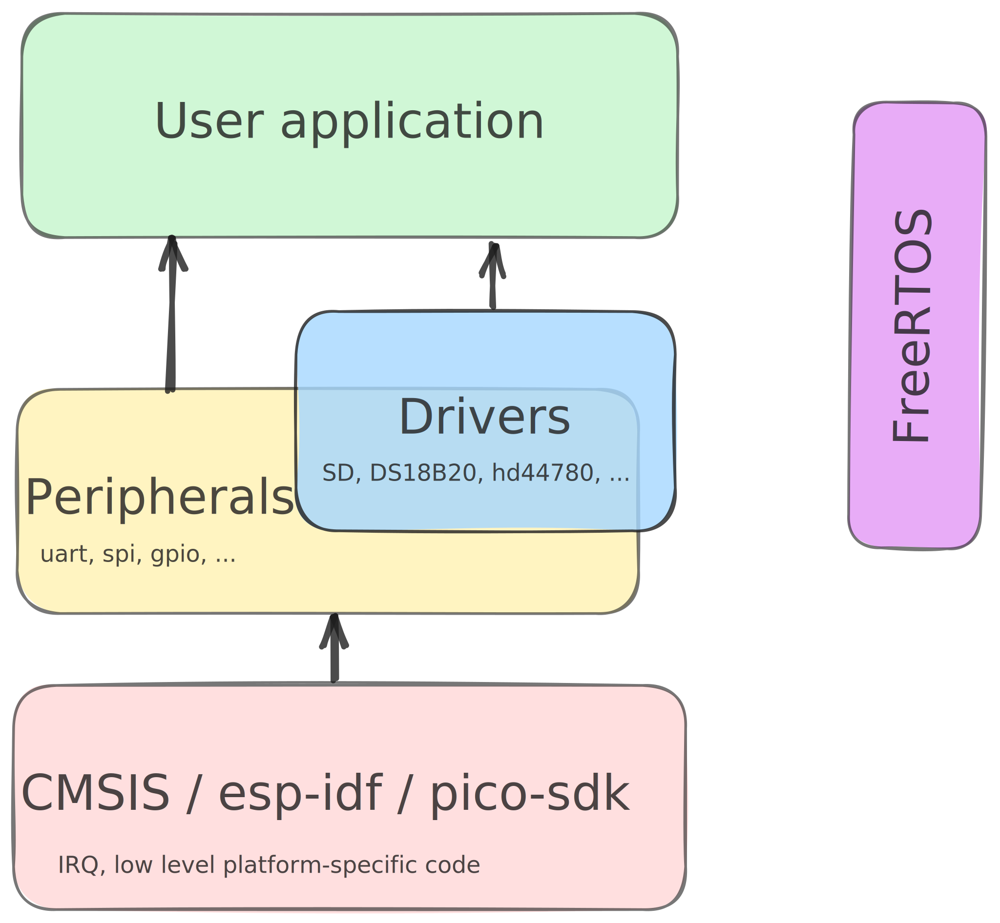

# mcu-cpp

[](https://github.com/yh-sb/mcu-cpp/actions/workflows/build.yml)

One C++ project for different microcontrollers types. Focusing on hardware abstraction, modularity, and ease of use. Cross-platform 🪟 🐧 🍎.

See [examples](./examples/stm32f4).

## Project structure


* [Drivers](./drivers/include/drivers) — hardware abstraction modules for various sensors and devices.
* [Peripherals](./periph/include/periph) - hardware abstraction interfaces to MCU hardware.
* [CMSIS / esp-idf / pico-sdk / ...](./third_party) — MCU-specific layers that **should not be used directly** in the **User application**.

## How it looks in code
```cpp
int main(int argc, char *argv[])
{
    periph::systick::init();
    
    // Green LED
    periph::gpio_stm32f4 green_led(periph::gpio_stm32f4::port::d, 12, periph::gpio::mode::digital_output, 1);
    
    // Init code to work with SD Card over SPI interface
    periph::gpio_stm32f4 mosi(periph::gpio_stm32f4::port::a, 7, periph::gpio::mode::alternate_function);
    periph::gpio_stm32f4 miso(periph::gpio_stm32f4::port::a, 6, periph::gpio::mode::alternate_function);
    periph::gpio_stm32f4 clk(periph::gpio_stm32f4::port::a, 5, periph::gpio::mode::alternate_function);
    periph::gpio_stm32f4 cs(periph::gpio_stm32f4::port::a, 4, periph::gpio::mode::digital_output, 1);
    periph::gpio_stm32f4 card_detect(periph::gpio_stm32f4::port::a, 3, periph::gpio::mode::digital_input, 1);
    periph::dma_stm32f4 spi1_read_dma(2, 0, 3, periph::dma_stm32f4::direction::periph_to_memory, 8);
    periph::dma_stm32f4 spi1_write_dma(2, 3, 3, periph::dma_stm32f4::direction::memory_to_periph, 8);
    periph::spi_stm32f4 spi1(1, 1000000, periph::spi::cpol::low, periph::spi::cpha::leading,
        periph::spi::bit_order::msb, spi1_write_dma, spi1_read_dma, mosi, miso, clk);
    
    drv::sd_spi sd_card(spi1, cs, &card_detect);
```

## How to build
```bash
git clone --recursive https://github.com/yh-sb/mcu-cpp.git
cd mcu-cpp

# Default target is STM32F4
make

# To set up the project for a different MCU, choose one of the following options:
make <esp32s3|rp2040|stm32f0|stm32f1|stm32f4>
# This copies CMakeLists.txt and a basic example from ./examples to the root CMakeLists.txt and main.cpp
```
**Other make commands:**
* `make flash` - Upload firmware to the target
* `make erase` - Erase all memory on the target
* `make reset` - Reset the target
* Debug is available in VSCode **or** using `make debug` target to start GDB server

## Requirements
* [GNU Arm Embedded Toolchain](https://developer.arm.com/downloads/-/arm-gnu-toolchain-downloads)
* [CMake](https://github.com/Kitware/CMake/releases)
* [Make](https://github.com/maweil/MakeForWindows/releases)
* [Ninja](https://github.com/ninja-build/ninja/releases)
* [JLink](https://www.segger.com/downloads/jlink) for debugging and flashing firmware. Or just for STM32 only: **STM32CubeProgrammer** and **ST-LINK gdbserver** from [STM32CubeCLT](https://www.st.com/en/development-tools/stm32cubeclt.html?dl=redirect) package

## Requirements for ESP32 project
* [GNU Xtensa esp-elf toolchain](https://github.com/espressif/crosstool-NG/releases/tag/esp-13.2.0_20240530)
* [Python](https://www.python.org/downloads)
* Install python dependencies:
    ```sh
    python -m pip install --upgrade pip
    python third_party/esp-idf/tools/idf_tools.py install-python-env
    python -m pip install -r third_party/esp-idf/tools/requirements/requirements.core.txt
    ```

## MCU hardware peripherals support
| Hardware | STM32F0 | STM32F1  | STM32F4  | RP2040   | ESP32S3  |
| :------: | :-----: | :------: | :------: | :------: | :------: |
| ADC      |         |    ✅   |          |          |          |
| DAC      |         |    ✅   |    ✅    |          |          |
| EXTI     |    ✅   |    ✅   |    ✅    |          |          |
| GPIO     |    ✅   |    ✅   |    ✅    |    ✅    |    ✅   |
| I2C      |         |          |    ✅    |          |          |
| PWM      |         |    ✅   |    ✅    |          |          |
| RTC      |         |          |    ✅    |          |          |
| SPI      |    ✅   |    ✅   |    ✅    |          |          |
| Timer    |    ✅   |    ✅   |    ✅    |          |          |
| UART     |    ✅   |    ✅   |    ✅    |          |          |
| WDT      |    ✅   |    ✅   |    ✅    |          |          |

*New peripherals may be added in future updates*

Contributions, suggestions, and new ideas are always welcome!
